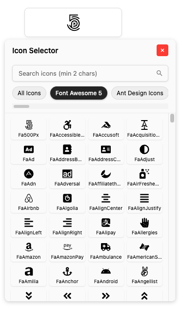

# React Icons Selector

A simple and customizable icon selector component supporting multiple icon libraries, built with the react-icons library for use in your React applications.

<p align="center">
  
</p>

<p align="center">
  <a href="https://github.com/batuhankaan/react-icons-selector/star">
    
  </a>
  <a href="https://www.npmjs.com/package/react-icons-selector">
    
  </a>
  <a href="https://www.npmjs.com/package/react-icons-selector">
    
  </a>
  <a href="https://github.com/batuhankaan/react-icons-selector/blob/master/LICENSE">
    
  </a>
</p>

## Table of Contents

- [Features](#features)
- [Installation](#installation)
- [Usage](#usage)
- [Supported Icon Libraries](#supported-icon-libraries)
- [Customization](#customization)
- [Dependencies](#dependencies)
- [Contributors](#contributors)
- [License](#license)

## Features

- **Multiple Icon Library Support:** Supports popular libraries like Font Awesome, Material Design Icons, Ionicons, and more.
- **Search Functionality:** Allows searching icons by name with a delay setting for performance optimization.
- **Enhanced UI:** Interactive tooltip/popup interface for selecting icons with smooth animations.
- **Customizable Interface:** Options to customize button styles and language text.
- **Dynamic Icon Loading:** Icons are dynamically loaded based on user input.
- **SVG Export:** Get direct SVG output for selected icons for further usage.
- **Improved Navigation:** Horizontal scrollable category layout for quick access.
- **Smart Positioning:** Tooltip automatically positions itself relative to the button for optimal visibility.
- **Compact Design:** Efficiently displays icons in a responsive grid layout.
- **Keyboard Navigation:** Focus-trap and accessibility features for improved usability.

## Installation

Install the necessary dependencies to add this component to your project:

```bash
npm install react-icons-selector --save
```

## Usage

Here’s an example of how to use the **React Icons Selector** component in your project:

```jsx
import React, { useState } from 'react';
import ReactIconsSelector, { RenderIcon } from 'react-icons-selector';

const MyComponent = () => {
  const [selectedIcon, setSelectedIcon] = useState(null);

  return (
    <div>
      <ReactIconsSelector
        value={selectedIcon}
        onChange={setSelectedIcon}
      />
      
      {selectedIcon && (
        <div>
          <p>Selected Icon:</p>
          <RenderIcon iconData={selectedIcon} size={40} color="red" />
        </div>
      )}
    </div>
  );
};

export default MyComponent;
```

## Customization

Here’s an example of using the **React Icons Selector** component with custom settings:

```jsx
import React, { useState } from 'react';
import ReactIconsSelector, { RenderIcon } from 'react-icons-selector';

const MyComponent = () => {
  const [selectedIcon, setSelectedIcon] = useState({
    name: 'MdOutlineSearch',
    library: 'Material Design Icons',
  });
  const [svgCode, setSvgCode] = useState('');

  return (
    <div>
      <ReactIconsSelector
        value={selectedIcon}
        onChange={setSelectedIcon}
        icons={["Font Awesome 5", "Ant Design Icons", "css.gg"]}
        buttonStyle={{ width: 200, fontSize: 40 }}
        buttonClassName="btn"
        iconSize={35}
        onSvgExport={(svg) => setSvgCode(svg)}
        language={{
            homeText: "All Icons",
            headerText: "Pick Your Icon",
            noIconsFoundText: "No icons matched your search.",
            homeSearchText: "Search icons...",
            buttonText: "Choose an Icon",
        }}
      />

      {/* Render the selected icon with custom size and color */}
      <div style={{ marginTop: 20 }}>
        <RenderIcon 
          iconData={selectedIcon} 
          size={100} 
          color="blue"
        />
      </div>
      
      {/* Display SVG code */}
      <div style={{ marginTop: 20 }}>
        <h3>SVG Code:</h3>
        <pre style={{ background: '#f5f5f5', padding: 10 }}>
          {svgCode}
        </pre>
      </div>
    </div>
  );
};

export default MyComponent;
```

## Supported Icon Libraries

This selector supports the following icon libraries:

- Font Awesome 5
- Ant Design Icons
- BoxIcons
- Bootstrap Icons
- css.gg
- Devicons
- Feather
- Game Icons
- Github Octicons
- Grommet Icons
- Heroicons
- Ionicons 4 & 5
- Material Design Icons
- Remix Icons
- Simple Icons
- Tabler Icons
- Typicons
- Phosphor Icons
- VS Code Icons
- Weather Icons
- Line Awesome
- IcoMoon Free
- Lucide
- Circum Icons

## Dependencies

The following libraries are required for this project:

- `react-icons`: A library for using popular icons in React applications.
- `react-dom`: Used for server-side rendering to generate SVG strings.

This package has the following peer dependencies:
```json
"peerDependencies": {
  "react": ">=17.0.0",
  "react-dom": ">=17.0.0",
  "react-icons": ">=4.0.0"
}
```

## Changelog

### v0.3.3
- Fixed "Maximum update depth exceeded" error that could occur in certain situations
- Optimized useEffect dependency management to prevent infinite render loops

## RenderIcon Component

The package exports a `RenderIcon` component that makes it easy to render your selected icons:

```jsx
import { RenderIcon } from 'react-icons-selector';

// Using the component
<RenderIcon 
  iconData={selectedIcon} // The icon object with name and library properties
  size={40}              // Optional: Icon size (defaults to 24)
  color="red"            // Optional: Icon color
  style={{}}             // Optional: Additional style object
  className="my-icon"    // Optional: CSS class
/>
```

### RenderIcon Props

| Prop | Type | Default | Description |
|------|------|---------|-------------|
| `iconData` | Object | required | Icon data object with `name` and `library` properties |
| `size` | Number | 24 | Size of the icon |
| `color` | String | inherit | Color of the icon |
| `style` | Object | {} | Additional styles to apply to the icon |
| `className` | String | "" | CSS class name to apply to the icon |

## ReactIconsSelector Props

| Prop | Type | Default | Description |
|------|------|---------|-------------|
| `value` | Object | null | The currently selected icon with `name` and `library` properties |
| `onChange` | Function | required | Callback function when an icon is selected |
| `icons` | Array | All libraries | List of icon libraries to display |
| `language` | Object | (see below) | Text customizations for UI elements |
| `buttonStyle` | Object | {} | Custom styles for the selector button |
| `buttonClassName` | String | "" | Custom CSS class for the selector button |
| `iconSize` | Number | 35 | Size of icons in the grid |
| `onSvgExport` | Function | null | Callback function that receives the SVG string and icon data |

### Default Language Object

```js
{
  homeText: "Home",
  headerText: "Icon Selector",
  noIconsFoundText: "No icons found.",
  homeSearchText: "Please enter at least 2 characters..",
  buttonText: "Select Icon"
}
```

## Contributors

- [Batuhan Kaan](https://github.com/batuhankaan)

## License

This project is licensed under the MIT License. For more information, see the [LICENSE](LICENSE) file.